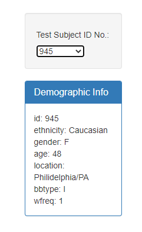
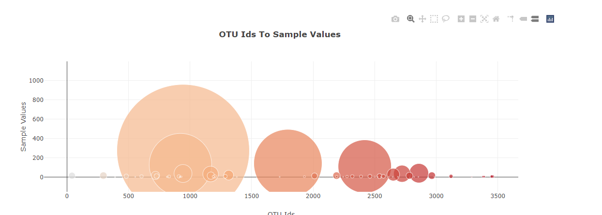
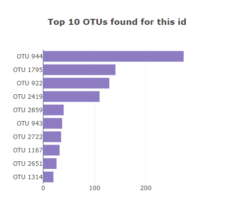
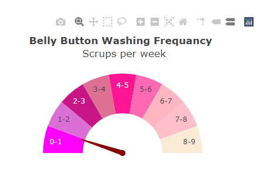

# Plotly_using_javascript

In this Repo you will find JavaScript file, json file and Html file. 

I used in the JS file functions thats work since I clicked on it to run the code.
there is init() function using Plotly library to create bar chart, bubble chart and gauge chart.

The charts and information box work in diffrents values since the id change.

The data was deployed on github web page and [here](https://haifanajdawi.github.io/Plotly_using_javascript/) the link.

And here we are sample of the charts:

* Box information:

* Bubble chart:

* Bar Chart:

* Gauge chart:

